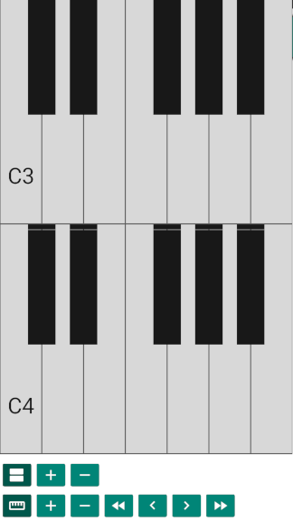

= Tonality - a free piano
(C) Sascha Lüdecke <sascha@currit.net>

Tonality is based on:

    Semitone - tuner, metronome, and piano for Android
    Copyright (C) 2019  Andy Tockman <andy@tck.mn>
    Official website:     https://tck.mn/semitone/

== Feature Overview

Tonality provides a piano view, to allow to play on a simple piano keyboard.

Features:

* [x] Piano view to play with
* [ ] Optional key labelling
* [x] Dynamic sizing of the keyboard
* [x] Stack multiple keyboards
* [x] Scale highlighting

TODO

* [ ] fix display bug when showing multiple key rows (gap is undefined)
* [ ] I18N of scale names
* [ ] Implement preferences dialog
* [ ] add reset button to piano view
* [ ] add nice app icon
* [ ] top of keys needs a black border, too

.Tonality as of version 0.1

== License

see LICENSE file for more details and this snippet for an overview:

____
This program is free software: you can redistribute it and/or modify
it under the terms of the GNU General Public License as published by
the Free Software Foundation, either version 3 of the License, or
(at your option) any later version.

This program is distributed in the hope that it will be useful,
but WITHOUT ANY WARRANTY; without even the implied warranty of
MERCHANTABILITY or FITNESS FOR A PARTICULAR PURPOSE.  See the
GNU General Public License for more details.

You should have received a copy of the GNU General Public License
along with this program.  If not, see <http://www.gnu.org/licenses/>.
____

== Development

=== Build instructinos

* checkout tonality
* convert semitone into an android library (semitone/build.gradle)
    - change build gradle plugin to library
    - comment out application ID
* prepare building semitone:
    . `cd semitone`
    . `./tools/build_ffmpeg.sh`
    . `./tools/copy_ffmpeg.sh`
* build tonality:
    - `gradle build`

=== Interaction with upstream semitone

These commands assume that remotes named `semitone-upstream` and `semitone-as-a-library`.
have been set up

pull::
    * commit all changes
    * `git subtree pull --prefix semitone semitone-upstream master`

push::
    * commit all changes
    * `git subtree push --prefix semitone semitone-fork semitone-as-a-library`
    * add pull request towards semitone project