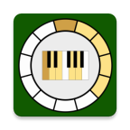
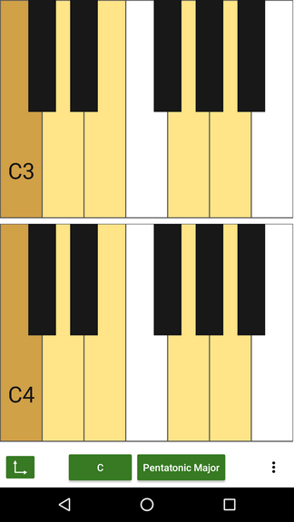
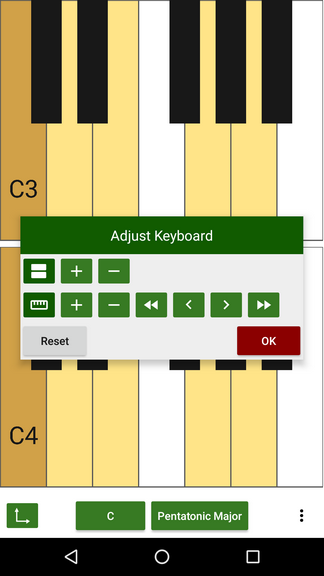
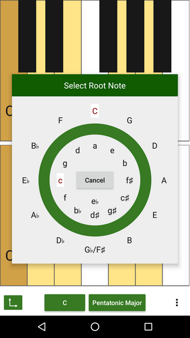
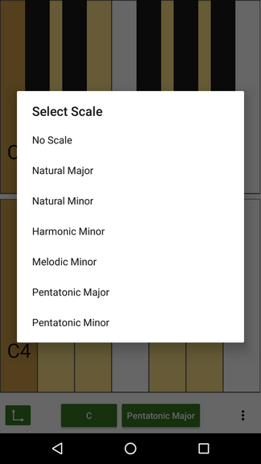
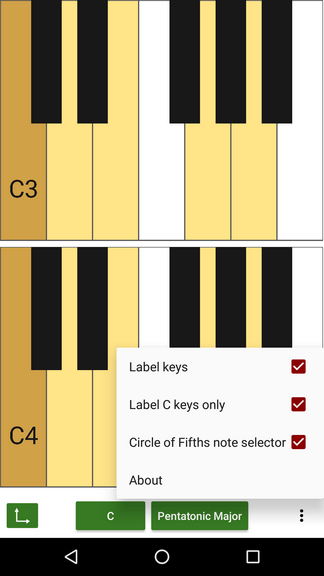

= Tonality - a free piano
(C) Sascha Lüdecke <sascha@currit.net>
:toc:

== About

Copyright (C) 2019  Sascha Lüdecke <sascha@meta-x.de>

Tonality is based on:

[%hardbreaks]
Semitone - tuner, metronome, and piano for Android
by Andy Tockman <andy@tck.mn>
Official website:     https://tck.mn/semitone/

=== Getting Tonality

image:https://f-droid.org/badge/get-it-on.png[Get it on F-Droid, height=75]

image:https://img.shields.io/f-droid/v/net.currit.tonality.svg[]
image:https://img.shields.io/github/release/sluedecke/tonality.svg?logo=github[]

== Feature Overview

Tonality provides a piano view, to allow to play on a simple piano keyboard.
Based on a root note, different scales can be highlighted on the keyboard to
ease learning of a scale.

Features:

* Piano view to play with
* Optional key labeling
* Dynamic sizing of the keyboard
* Stack multiple keyboards
* Scale highlighting

=== Possible next features ... or just a bunch of ideas

* [ ] highlight (and optionally label) some important intervals based on the root note
* [ ] harmonize handling of pianoview parameters in preferences (currently in PianoView and PianoFragment)
* [ ] grey out or hide notes which cannot be played due to missing sound file
* [ ] create custom textviews which take note name, piano, handler and item to position around
* [ ] add some open source synth to tonality in order to play more than audio files
* [ ] add more scales
* [ ] add MIDI keyboard support via USB on the go
* [ ] add metronome to piano view

=== Screenshots of Tonality (Version 1.1)

== License

see LICENSE file for more details and this snippet for an overview:

____
This program is free software: you can redistribute it and/or modify
it under the terms of the GNU General Public License as published by
the Free Software Foundation, either version 3 of the License, or
(at your option) any later version.

This program is distributed in the hope that it will be useful,
but WITHOUT ANY WARRANTY; without even the implied warranty of
MERCHANTABILITY or FITNESS FOR A PARTICULAR PURPOSE.  See the
GNU General Public License for more details. +

You should have received a copy of the GNU General Public License
along with this program.  If not, see <http://www.gnu.org/licenses/>.
____

== Development

=== Build instructinos

* checkout tonality
* Ensure the environment variable `ANDROID_NDK` is set
* Ensure that gradle can call `patch` and `git`, i.e. these should be on your `PATH`
* Prepare dependencies - this will pull git submodules and build native ffmpeg binaries
    - `gradle setupTonalityDependencies` +
* build tonality:
    - `gradle build`

=== Interaction with upstream semitone

You will probably need these only as a maintainer of the project.

These commands assume that remotes named `semitone-upstream` and `semitone-as-a-library`.
have been set up.

pull::
    * commit all changes
    * `git subtree pull --prefix semitone semitone-upstream master`
    * convert semitone into an android library by changing semitone/build.gradle
        - change build gradle plugin to library
        - comment out application ID

push::
    * commit all changes
    * `git subtree push --prefix semitone semitone-fork semitone-as-a-library`
    * add pull request towards semitone project