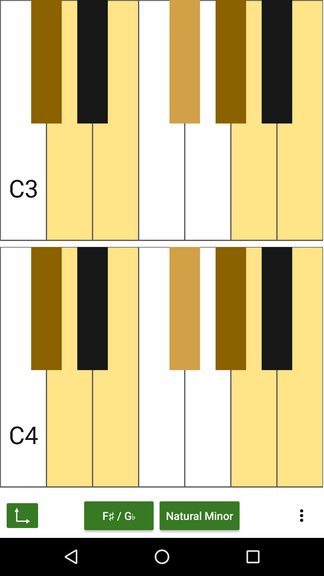
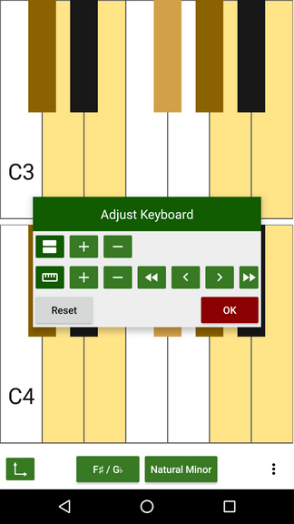
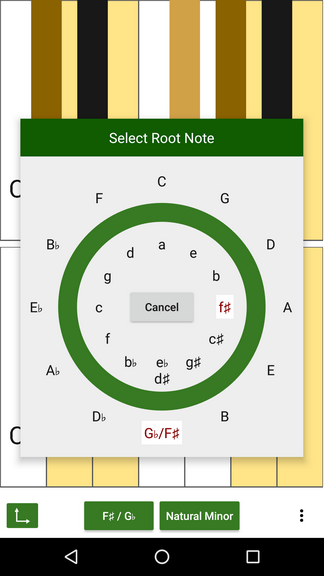
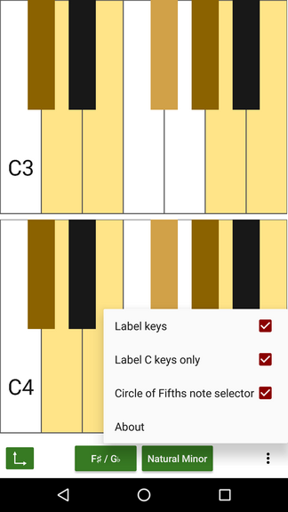

= Tonality - a free piano
(C) Sascha Lüdecke <sascha@currit.net>

Tonality is based on:

    Semitone - tuner, metronome, and piano for Android
    Copyright (C) 2019  Andy Tockman <andy@tck.mn>
    Official website:     https://tck.mn/semitone/

== Feature Overview

Tonality provides a piano view, to allow to play on a simple piano keyboard.

Features:

* Piano view to play with
* Optional key labelling
* Dynamic sizing of the keyboard
* Stack multiple keyboards
* Scale highlighting

=== TODO before 1.0

* [x] Implement preferences dialog
* [x] add reset button to sizing dialog
* [x] I18N of scale names
* [x] popups shall have a proper shadow / elevation
* [x] fix display bug for octave right in sizing popup
* [x] use circle of fifths to select root note
* [x] add nice app icon
* [-] label too high in horizontal mode
* [-] automate updating semitone
* [ ] automate building from scratch to ease use in f-droid
* [ ] minify apks, strip unneeded semitone assets
* [ ] publish in Play Store and on f-droid

=== Possible next features ... or just a bunch of ideas

* [ ] highlight (and optionally label) some important intervals based on the root note
* [ ] harmonize handling of pianoview parameters in preferences (currently in PianoView and PianoFragment)
* [ ] grey out or hide notes which cannot be played due to missing sound file
* [ ] create custom textviews which take note name, piano, handler and item to position around
* [ ] add some open source synth to tonality in order to play more than audio files
* [ ] add more scales

.Tonality as of 2019-06-04

== License

see LICENSE file for more details and this snippet for an overview:

____
This program is free software: you can redistribute it and/or modify
it under the terms of the GNU General Public License as published by
the Free Software Foundation, either version 3 of the License, or
(at your option) any later version.

This program is distributed in the hope that it will be useful,
but WITHOUT ANY WARRANTY; without even the implied warranty of
MERCHANTABILITY or FITNESS FOR A PARTICULAR PURPOSE.  See the
GNU General Public License for more details.

You should have received a copy of the GNU General Public License
along with this program.  If not, see <http://www.gnu.org/licenses/>.
____

== Development

=== Build instructinos

* checkout tonality
* convert semitone into an android library (semitone/build.gradle)
    - change build gradle plugin to library
    - comment out application ID
* prepare building semitone:
    . `cd semitone`
    . `./tools/build_ffmpeg.sh`
    . `./tools/copy_ffmpeg.sh`
* build tonality:
    - `gradle build`

=== Interaction with upstream semitone

These commands assume that remotes named `semitone-upstream` and `semitone-as-a-library`.
have been set up

pull::
    * commit all changes
    * `git subtree pull --prefix semitone semitone-upstream master`

push::
    * commit all changes
    * `git subtree push --prefix semitone semitone-fork semitone-as-a-library`
    * add pull request towards semitone project