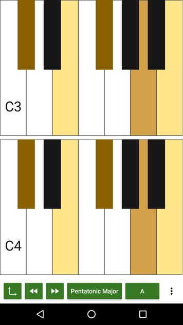
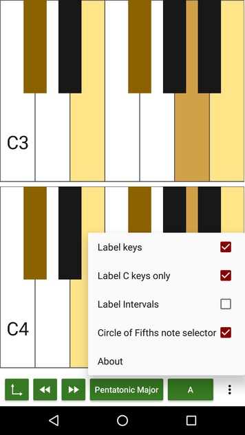
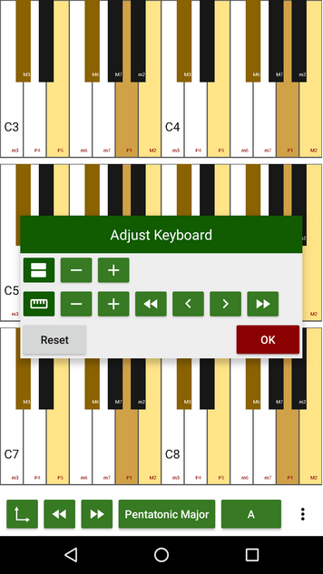

= Tonality - a free piano
(C) Sascha Lüdecke <sascha@currit.net>
:toc:

== About

image:app/src/main/res/mipmap-xxhdpi/ic_launcher.png[]

Tonality is a simple piano keyboard.  It allows to highlight scales based on
a root note and can label intervals for you.  This makes learning of scales much easier.

Copyright (C) 2019  Sascha Lüdecke <sascha@meta-x.de>

Tonality is based on:

[%hardbreaks]
Semitone - tuner, metronome, and piano for Android
by Andy Tockman <andy@tck.mn>
Official website:     https://tck.mn/semitone/

=== Getting Tonality

image:https://f-droid.org/badge/get-it-on.png[Get it on F-Droid, height=75, link="https://f-droid.org/packages/net.currit.tonality/"]
image:https://play.google.com/intl/en_us/badges/images/generic/en_badge_web_generic.png[link="https://play.google.com/store/apps/details?id=net.currit.tonality", Get it on Google Play, height=75]

image:https://img.shields.io/f-droid/v/net.currit.tonality[]
image:https://img.shields.io/github/tag/sluedecke/tonality[]
image:https://img.shields.io/github/issues/sluedecke/tonality["Tonality issues",link="https://github.com/sluedecke/tonality/issues"]
image:https://img.shields.io/github/license/sluedecke/tonality["Tonality license",link="https://github.com/sluedecke/tonality/blob/master/LICENSE"]

== Feature Overview

Tonality is a simple piano keyboard.  It allows to highlight scales based on
a root note and can label intervals for you.  This makes learning of scales much easier.

Features:

* Piano view to play with
* Scale highlighting
* Optional key labeling
* Optional interval labeling based on root note
* Dynamic sizing of the keyboard
* Stack multiple keyboards

=== Screenshots of Tonality (Version 1.2)

image:app/src/main/play/listings/en-US/graphics/phone-screenshots/tonality-v1.2 - 1. main.png[]
image:app/src/main/play/listings/en-US/graphics/phone-screenshots/tonality-v1.2 - 2. scale selection.png[]
image:app/src/main/play/listings/en-US/graphics/phone-screenshots/tonality-v1.2 - 3. scale highlight.png[]
image:app/src/main/play/listings/en-US/graphics/phone-screenshots/tonality-v1.2 - 4. root note selection.png[]

=== Possible next features ... or just a bunch of ideas

* [ ] harmonize handling of pianoview parameters in preferences (currently in PianoView and PianoFragment)
* [ ] grey out or hide notes which cannot be played due to missing sound file
* [ ] add some open source synth to tonality in order to play more than audio files
* [ ] improve scale selection with custom dialog and scale grouping
* [ ] add MIDI keyboard support via USB on the go
* [ ] add metronome to piano view
* [ ] automate screenshot generation combined with espresso UI testing
* [ ] add link to google play, fix link to f-droid once published there

== License

see LICENSE file for more details and this snippet for an overview:

____
This program is free software: you can redistribute it and/or modify
it under the terms of the GNU General Public License as published by
the Free Software Foundation, either version 3 of the License, or
(at your option) any later version.

This program is distributed in the hope that it will be useful,
but WITHOUT ANY WARRANTY; without even the implied warranty of
MERCHANTABILITY or FITNESS FOR A PARTICULAR PURPOSE.  See the
GNU General Public License for more details. +

You should have received a copy of the GNU General Public License
along with this program.  If not, see <http://www.gnu.org/licenses/>.
____

== Development

=== Build instructinos

* checkout tonality
* Ensure the environment variable `ANDROID_NDK` is set
* Ensure that gradle can call `patch` and `git`, i.e. these should be on your `PATH`
* Prepare dependencies - this will pull git submodules and build native ffmpeg binaries
    - `gradle setupTonalityDependencies` +
* build tonality:
    - `gradle build`

=== Interaction with upstream semitone

You will probably need these only as a maintainer of the project.

These commands assume that remotes named `semitone-upstream` and `semitone-as-a-library`.
have been set up.

pull::
    * commit all changes
    * `git subtree pull --prefix semitone semitone-upstream master`
    * convert semitone into an android library by changing semitone/build.gradle
        - change build gradle plugin to library
        - comment out application ID

push::
    * commit all changes
    * `git subtree push --prefix semitone semitone-fork semitone-as-a-library`
    * add pull request towards semitone project